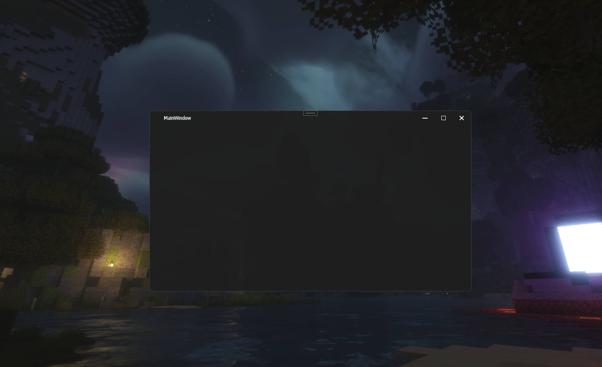

[]
- [NuGet Package](https://www.nuget.org/packages/Wpf.DarkWindow/1.0.0)
- [License](LICENSE.txt)

A small library for modifying the visual aspects of application windows in Windows OS. It works on both Windows 10 and Windows 11.

Небольшая библиотека для изменения визуальных аспектов окон приложений в операционной системе Windows. Она работает как на Windows 10, так и на Windows 11.




# Wpf.DarkWindow

App.xaml

```html
<Application.Resources>
  <ResourceDictionary>
    <ResourceDictionary.MergedDictionaries>
      <ResourceDictionary
        Source="/Wpf.DarkWindow;component/Themes/AllExport.xaml"
      />
    </ResourceDictionary.MergedDictionaries>
  </ResourceDictionary>
</Application.Resources>
```

MainWindow.xaml

```html
<wpf:DarkWindow
  xmlns:wpf="clr-namespace:Wpf.DarkWindow.Controls;assembly=Wpf.DarkWindow"
  Style="{DynamicResource DarkWindow.base}"
  x:Class="TestDarkWindow.MainWindow"
  xmlns="http://schemas.microsoft.com/winfx/2006/xaml/presentation"
  xmlns:x="http://schemas.microsoft.com/winfx/2006/xaml"
  xmlns:d="http://schemas.microsoft.com/expression/blend/2008"
  xmlns:mc="http://schemas.openxmlformats.org/markup-compatibility/2006"
  xmlns:local="clr-namespace:TestDarkWindow"
  mc:Ignorable="d"
  ButtonBrush="White"
  CloseButtonBrush="White"
  Background="#f51e1e1e"
  Title="MainasdasdWindow"
  Height="450"
  Width="800"
>
  <Grid> </Grid>
</wpf:DarkWindow>
```

```cs
public partial class MainWindow : DarkWindow
{
    public MainWindow()
    {
        InitializeComponent();
    }
}
```
